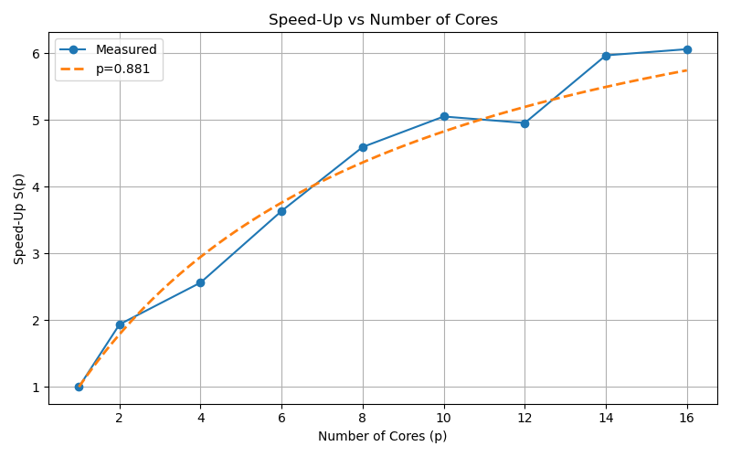
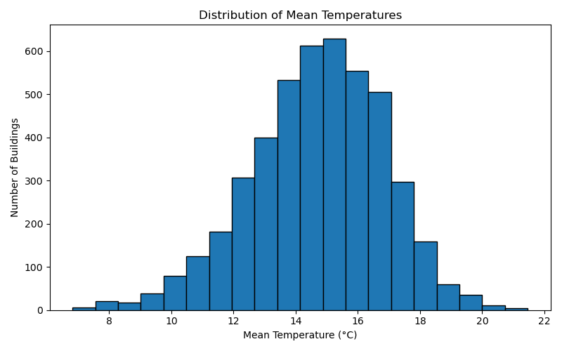

# 02613_HPC_project

### Tasks 
**1.** 
Familiarize yourself with the data. Load and visualize the input data for a few floorplans using aseperate Python script, Jupyter notebook or your preferred tool.

Results for building_id 10000:

| building_id | mean_temp       | std_temp       | pct_above_18       | pct_below_15       |
|-------------|-----------------|----------------|--------------------|--------------------|
| 10000       | 14.01233878811275 | 6.367431059312565 | 30.941014791508444 | 55.542295034537624 |

**2.** Familiarize yourself with the provided script. Run and time the reference implementation for asmall subset of floorplans (e.g., 10 - 20). How long do you estimate it would take to process all the floorplans? Perform the timing as a batch job so you get relieable results.

Time python gives the following time for 10 samples

| Time type | Duration |
| --------  | -------   |
| real      | 1m15.619s |
| user	    | 1m14.981s |
| sys	    | 0m0.178s  |

Using ls /dtu/projects/02613_2025/data/modified_swiss_dwellings/ | wc -l there is 4571 different building id's

The esitmated time to process all floor plans is approximately 9h30m

Requested hardware for the timing:
| Resource Type | Specification                    |
|---------------|----------------------------------|
| CPU           | 20 cores (Intel Xeon Gold 6226R) |
| Memory        | 1 GB                            |

**3.** Visualize the simulation results for a few floorplans.

  
  
    
  

**4.** Profile the reference jacobi function using kernprof. Explain the different parts of the function and how much time each part takes.

| Line # | Hits  | Time (ms) | Per Hit (ms) | % Time | Line Contents                                                                 |
|--------|-------|-----------|--------------|--------|-------------------------------------------------------------------------------|
| 6      |       |           |              |        | @profile                                                                      |
| 7      |       |           |              |        | def jacobi(u, interior_mask, max_iter, atol=1e-6):                            |
| 8      | 1     | 1589.6    | 1589.6       | 0.0    | u = np.copy(u)                                                                |
| 10     | 3602  | 1583.7    | 0.4          | 0.0    | for i in range(max_iter):                                                     |
| 12     | 3602  | 3121563.2 | 866.6        | 59.8   | u_new = 0.25 * (u[1:-1, :-2] + u[1:-1, 2:] + u[:-2, 1:-1] + u[2:, 1:-1])      |
| 13     | 3602  | 567247.1  | 157.5        | 10.9   | u_new_interior = u_new[interior_mask]                                         |
| 14     | 3602  | 913969.2  | 253.7        | 17.5   | delta = np.abs(u[1:-1, 1:-1][interior_mask] - u_new_interior).max()           |
| 15     | 3602  | 609825.0  | 169.3        | 11.7   | u[1:-1, 1:-1][interior_mask] = u_new_interior                                 |
| 17     | 3602  | 3200.8    | 0.9          | 0.1    | if delta < atol:                                                              |
| 18     | 1     | 0.5       | 0.5          | 0.0    | break                                                                         |
| 19     | 1     | 0.2       | 0.2          | 0.0    | return u                                                                      |

  
  
The plot shows residuals from a Method of Manufactured Solutions (MMS) problem for the NumPy Jacobi solver. The exponential decrease in residuals over iterations confirms the method's convergence properties. The steep decline indicates the solver efficiently reaches the specified tolerance criteria while correctly approximating the manufactured solution.

**5.** Make a new Python program where you parallelize the computations over the floorplans. Usestatic scheduling such that each worker is assigned the same amount of floorplans to process. You should use no more than 100 floorplans for your timing experiments. Again, use a batch job to ensure consistent results.

Requested hardware for the static scheduling:
| Resource Type | Specification                    |
|---------------|----------------------------------|
| CPU           | 16 cores (Intel Xeon Gold 6226R) |
| Memory        | 1 GB                            |

- a)   Measure the speed-up as more workers are added. Plot your speed-ups.

  

    
  

- b) Estimate your parallel fraction according to Amdahl's law. How much (roughly) is paral-lelized?

    To estimate the parallel fraction while considering all experiments, an ODE fit is used on the observations. This yields following figure:
    
    

      
    

    Where roughly 84% is parallelized.

- c) What is your theoretical maximum speed-up according to Amdahl's law? How much of thatdid you achieve? How many cores did that take?
    
    With the fomer estimated parallel fraction, the maxmimum speed-up according to Amdahl's law is found as:

    $$S(\infty) = \frac{1}{1 - 0.84} \approx 6.23 $$

    From the figure in 5.a, it is seen that a speedup of around 4 is achieved with 16 parallel threads.

- d) How long would you estimate it would take to process all floorplans using your fastestparallel solution?
  
  Considering that the runtime of the statically parallelized script with 16 cores is approximately 51.145 seconds for 20 floorplans, the time per floorplan is about 2.557 seconds. Assuming this rate, processing all floorplans would take around 3 hours, 14 minutes, and 48 seconds.

  This demonstrates that static parallelization significantly reduced the original runtime, as about 8 hours has been cut off. This would mean than more than half of the original runtime has been removed with static parallelization.

**6.** The amount of iterations needed to reach convergence will vary from floorplan to floorplan. Re-do your parallelization experiment using dynamic scheduling.

Requested hardware for the dynamic scheduling:
| Resource Type | Specification                    |
|---------------|----------------------------------|
| CPU           | 16 cores (Intel Xeon Gold 6226R) |
| Memory        | 1 GB                            |

- a)   Did it get faster? By how much?

  

      
  

  The figure highlights runtimes of both static and dynamic parallelization where it is evident that static scheduling initially has an advantage compared to dynamic scheduling. This is most likely due to the overhead of assigning workers to tasks when there is few workers available.

  As stated in the problemformulation, the convergence will vary from floorplan to floorplan which would make dynamic scheduling as the obvious choice for parallelization. The advantage is seen at around 8 workers where the runtime becomes quicker than static scheduling, and for the rest of the workers it stays that way.

  So, in summary, if enough workers are available, then dynamic scheduling will be quicker than static scheduling due to the difference of convergence rates from floorplans. 

- b)   Did the speed-up improve or worsen?

  

      
  

  From the figure, equivalent to 5.b but script with dynamic scheduling, it becomes evident that speedup sees a significant improvement, and around 88% of the script is parallized. The maximum achieved speedup is around 6 which is almost 1.5x better than what was achieved with static scheduling. 

  Moreover, comparing theoretical maximum speedups:
  
  $S_{dynamic}(\infty)=8.40$,

  $S_{static}(\infty)=6.23$,

  it is evident that the solution which utilizes dynamic scheduling will scale better with more number of workers due to the difference in computation time of each job handled by a single worker.

**7.** Implement another solution where you rewrite the jacobi function using Numba JIT on the CPU.

Requested hardware for the Numba JIT implementation:
| Resource Type | Specification                    |
|---------------|----------------------------------|
| CPU           | 20 cores (Intel Xeon Gold 6226R) |
| Memory        | 1 GB                            |

- a)    Run and time the new solution for a small subset of floorplans. How does the performance compare to the reference?

  For the reference implementation with 10 floorplans:

  | Time type | Duration |
  | --------  | -------   |
  | real      | 1m7.277s |
  | user	    | 1m6.409s |
  | sys	    | 0m0.202s  |

  For the new rewritten jacobi function with 10 floorplans:

  | Time type | Duration |
  | -------- | -------   |
  | real	   | 0m48.596s |
  | user	   | 0m47.648s |
  | sys	   | 0m0.230s  |

  This represents approximately a 28% performance improvement over the reference implementation.

  
  
The Numba JIT implementation shows residuals from a Method of Manufactured Solutions (MMS) problem with error reduction following an exponential decay pattern. This confirms that the optimized implementation maintains the same mathematical convergence properties to the manufactured solution while improving computational efficiency.

- b)    Explain your function. How did you ensure your access pattern works well with the CPU cache?

  For implementing the numba jit version of the jacobi function, we had to rewrite the indexing as numba doesnt allow for boolean array indexing, eg. u_new_interior = u_new[interior_mask]. Instead we created two new list (ys and xs) using np.where. These lists contained the interior mask indexes in a row major order for which allows for optimal cache storing. A loop over these list was created for where the the difference for each index was calculated. If the difference is bigger than the current delta then it is assigned as delta.

- c)    How long would it now take to process all floorplans?

It will approxiamately take 6h9m

**8.** Implement another solution writing a custom CUDA kernel with Numba. To synchronize threads between each iteration, the kernel should only performa single iterationof the Jacobi solver. Skip the early stopping criteria and just run for a fixed amount of iterations. Write a helper function which takes the same inputs as the reference implementation (except for the atol input which is not needed) and then calls your kernel repeatedly to perform the implementations.

Requested hardware for the CUDA implementation:
| Resource Type | Specification                    |
|---------------|----------------------------------|
| GPU           | 1 × GPU (exclusive_process mode) |
| CPU           | 4 cores (Intel Xeon Gold 6226R)  |
| Memory        | 2 GB                            |

- a)    Briefly describe your new solution. How did you structure your kernel and helper function?

Our CUDA implementation leverages massive parallelism on the GPU by performing point-wise updates in parallel. The solution consists of two main components:

1. A CUDA kernel function (`jacobi_kernel`) that:
   - Uses CUDA's grid-stride pattern to assign each thread to a specific grid point
   - Each thread independently computes the new temperature at its assigned point
   - Only updates interior points based on the provided mask
   - Boundary conditions are preserved by maintaining original values

2. A helper function (`jacobi_cuda`) that:
   - Transfers the initial temperature field and mask to the GPU
   - Pre-allocates device memory for computation
   - Sets up the execution grid with appropriate block sizes (16×16 threads per block)
   - Repeatedly calls the kernel for each iteration
   - Performs convergence checks periodically (every `interval` iterations) to minimize costly host-device transfers
   - Swaps pointers between iterations to avoid unnecessary memory operations

This approach significantly reduces computation time by executing thousands of point updates simultaneously on the GPU, while minimizing data transfers between CPU and GPU.

A key optimization in our CUDA implementation is how we handle convergence testing. Unlike the CPU implementations that check convergence after every iteration, we:

1. Compute residuals less frequently (every `interval` iterations) to reduce costly host-device transfers
2. Use the algebraic residual (the norm of the discrete Laplacian) rather than the maximum point-wise difference between iterations
3. Only transfer the solution back to the host when performing convergence checks

The need to use algebraic residuals stem from the fact that maximum point-wise differences between iterations requires one to have the intermediate solutions from every iteration. This would require transfering solutions to the cpu every iteration. To be able to only do the convergence check every x iterations we need a different measure of convergence. The algebraic residual requires only information from the current iteration which enables us to only check for convergence occacionally. In our implementation we perform a check every 500 iterations. The algebraic residual based tolerance has been chose by computing the residual during iterations from our referance solution. 

This approach was critical for performance, as profiling (in task 10) showed that device-to-host transfers can consume up to 98% of execution time in naive GPU implementations. By reducing these transfers, we achieve much better utilization of the GPU's computational capabilities.

  
  
The CUDA implementation demonstrates residuals from a Method of Manufactured Solutions (MMS) problem following the expected convergence pattern. The plot confirms that the parallel GPU implementation maintains solution accuracy and convergence to the manufactured solution despite the architectural differences in computation.

- b)    Run and time the new solution for a small subset of floorplans. How does the performance compare to the reference?

  For the reference implementation with 10 floorplans:

  | Time type | Duration |
  | --------  | -------   |
  | real      | 1m7.277s |
  | user	    | 1m6.409s |
  | sys	    | 0m0.202s  |

  For the CUDA implementation with 10 floorplans:

  | Time type | Duration |
  | -------- | -------   |
  | real	   | 0m5.590s |
  | user	   | 0m4.319s |
  | sys	   | 0m0.482s  |

  This represents approximately a 92% reduction in runtime compared to the reference implementation, making it about 12 times faster.

- c)    How long would it now take to process all floorplans?

  Based on the timing of 5.59 seconds for 10 floorplans, processing all 4571 floorplans would take approximately 43m.

**9.**  Adapt the reference solution to run on the GPU using CuPy.

Requested hardware for the CuPy implementation:
| Resource Type | Specification                    |
|---------------|----------------------------------|
| GPU           | 1 × GPU (exclusive_process mode) |
| CPU           | 4 cores (Intel Xeon Gold 6226R)  |
| Memory        | 2 GB                            |

- a)    Run and time the new solution for a small subset of floorplans. How does the performance compare to the reference?

  For the reference implementation with 10 floorplans:

  | Time type | Duration |
  | --------  | -------   |
  | real      | 1m7.277s |
  | user	    | 1m6.409s |
  | sys	    | 0m0.202s  |

  For the CuPy implementation with 10 floorplans:

  | Time type | Duration |
  | --------  | -------   |
  | real	   | 0m18.088s |
  | user	   | 0m17.001s |
  | sys      | 0m0.363s  |

  This represents approximately a 73% reduction in runtime compared to the reference implementation, making it about 3.7 times faster.

  
  
The CuPy implementation shows the characteristic exponential decay in residuals from a Method of Manufactured Solutions (MMS) problem, confirming proper convergence. The solver reaches the same solution accuracy relative to the manufactured solution as other implementations while leveraging GPU acceleration through CuPy.

- b)    How long would it now take to process all floorplans?

I now takes approximately 2h18m

- c)    Was anything surprising about the performance?
Computing for 10 buildings was almost yeilded almost a 2x speed-up compared to the refrence.

**10.** Profile the CuPy solution using the nsys profiler. What is the main issue regarding performance? (Hint: see exercises from week 10) Try to fix it.

  The main issue regarding performance is the device to host transfer, which is 98% of time spent.
  This is mainly due to the convergence check each iteration, and a new solution was implemented trying to combat this issue. The new function makes fewer convergence checks and uses the norm to check calculate the residuals. Timed on a small subset of floorplans we get the following:

| Time type | Duration |
| -------- | -------   |
| real     | 0m17.632s |
| user	   | 0m16.500s |
| sys	   | 0m0.368s  |

**11. (Optional)** Improve the performance of one or more of your solutions further.  For example, parallelize your CPU JIT solution. Or use job arrays to parallelize a solution over multiple jobs. How fast can you get?

For the parallel Numba JIT implementation with 10 floorplans:

| Time type | Duration |
| -------- | -------   |
| real	   | 0m19.853s |
| user	   | 0m38.156s |
| sys	   | 0m7.193s  |

This represents a 59% reduction in runtime compared to the regular Numba JIT implementation and a 70% reduction compared to the reference implementation.

The parallel implementation uses Numba's `@njit(parallel=True)` decorator and `prange` to parallelize computation across CPU cores.

The inherent sequential iterations of the Jacobi method cannot be parallelized (each iteration depends on the results of the previous one), but since the Jacobi method only updates points based on neighboring values from the previous iteration, we can parallelize the computation within each iteration. This allows for row-wise parallel processing. 

  
  
The parallel Numba implementation demonstrates proper convergence with residuals from a Method of Manufactured Solutions (MMS) problem following the expected exponential decay. This confirms that the parallelization strategy maintains the mathematical integrity of the Jacobi solver in approximating the manufactured solution while improving computational performance.

### ⏱ **Execution Time (20 floors) Summary **
| Implementation                         | Time for 20 Floors | Time/Floor (s) | Speedup vs Baseline | Est. Total Time (4571 floors) |
|----------------------------------------|---------------------|----------------|----------------------|-------------------------------|
| Original (NumPy)                       | 2m50.839s           | 8.54           | 1.00×                | 10h 51m 34s                   |
| Numba (JIT)                            | 2m1.502s            | 6.08           | 1.40×                | 7h 43m 0s                     |
| Parallel Numba (CPU, prange)           | 0m50.763s           | 2.54           | 3.36×                | 3h 13m 7s                     |
| CuPy (GPU)                             | 0m41.531s           | 2.08           | 4.10×                | 2h 38m 44s                    |
| CUDA (Numba kernel)                    | 0m11.386s           | 0.57           | 15.00×               | 43m 24s                       |
| Dynamic Parallelized CUDA (best case)  | 0m7.294s            | 0.36           | 23.63×               | 27m 27s                       |

Requested hardware for the above runs: 
| Resource Type | Specification                    |
|---------------|----------------------------------|
| GPU           | 1 × GPU (exclusive_process mode) |
| CPU           | 4 cores (Intel Xeon Gold 6226R)  |
| Memory        | 15 GB                            |

> **Note:** Timing results and speedup comparisons may differ from other measurements in this document due to differences in requested hardware and system load variations. The relative performance trends should remain consistent, but absolute timings may vary. All the above timings were performed from the same jobsubmission. 
  
**12.** Process all floorplans using one of your implementations (ideally a fast one) and answer the below questions. Hint: use Pandas to process the CSV results generated by the script.

  A combination of the cuda-"ized" jacobi function and dýnamic parallelization was used to run through all floor plans which took approximately 29 minutes.

- a)    What is the distribution of the mean temperatures? Show your results as histograms.

  

      
  

- b)    What is the average mean temperature of the buildings?

  Average of mean temperatures is 14.71°C.

- c)    What is the average temperature standard deviation?

  Average of temperature std. dev. is 6.80°C

- d)    How many buildings had at least 50% of their area above 18ºC?

  811 buildings had at least 50% of their area above 18ºC.

- e)    How many buildings had at least 50% of their area below 15ºC?

  2464 buildings had at least 50% of their area below 15ºC.
