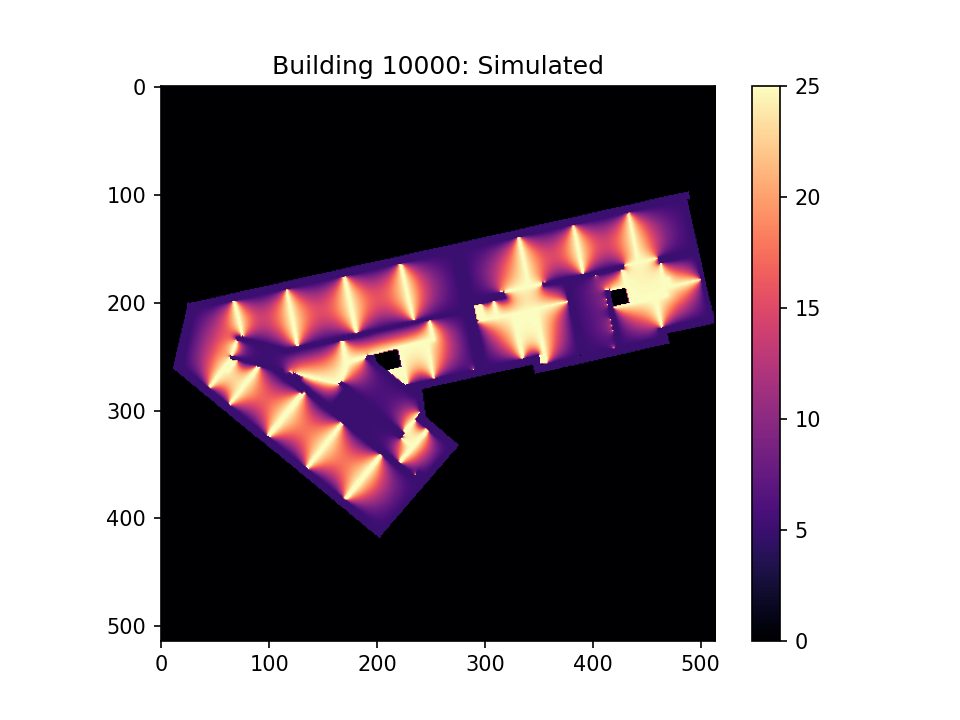

# 02613_HPC_project

### Tasks 
**1.** 
Familiarize yourself with the data. Load and visualize the input data for a few floorplans using aseperate Python script, Jupyter notebook or your preferred tool.

Results for building_id 10000:

| building_id | mean_temp       | std_temp       | pct_above_18       | pct_below_15       |
|-------------|-----------------|----------------|--------------------|--------------------|
| 10000       | 14.01233878811275 | 6.367431059312565 | 30.941014791508444 | 55.542295034537624 |

**2.** Familiarize yourself with the provided script. Run and time the reference implementation for asmall subset of floorplans (e.g., 10 - 20). How long do you estimate it would take to process all the floorplans? Perform the timing as a batch job so you get relieable results.

Time python gives the following time for 10 samples

| Time type | Duration |
| --------  | -------   |
| real      | 1m15.619s |
| user	    | 1m14.981s |
| sys	    | 0m0.178s  |

Using ls /dtu/projects/02613_2025/data/modified_swiss_dwellings/ | wc -l there is 9143 different building id's

The esitmated time to process all floor plans is approximately 19h1m

**3.** Visualize the simulation results for a few floorplans.

  
  
    

**4.** Profile the reference jacobi function using kernprof. Explain the different parts of the function and how much time each part takes.

| Line # | Hits  | Time (ms) | Per Hit (ms) | % Time | Line Contents                                                                 |
|--------|-------|-----------|--------------|--------|-------------------------------------------------------------------------------|
| 6      |       |           |              |        | @profile                                                                      |
| 7      |       |           |              |        | def jacobi(u, interior_mask, max_iter, atol=1e-6):                            |
| 8      | 1     | 1589.6    | 1589.6       | 0.0    | u = np.copy(u)                                                                |
| 10     | 3602  | 1583.7    | 0.4          | 0.0    | for i in range(max_iter):                                                     |
| 12     | 3602  | 3121563.2 | 866.6        | 59.8   | u_new = 0.25 * (u[1:-1, :-2] + u[1:-1, 2:] + u[:-2, 1:-1] + u[2:, 1:-1])      |
| 13     | 3602  | 567247.1  | 157.5        | 10.9   | u_new_interior = u_new[interior_mask]                                         |
| 14     | 3602  | 913969.2  | 253.7        | 17.5   | delta = np.abs(u[1:-1, 1:-1][interior_mask] - u_new_interior).max()           |
| 15     | 3602  | 609825.0  | 169.3        | 11.7   | u[1:-1, 1:-1][interior_mask] = u_new_interior                                 |
| 17     | 3602  | 3200.8    | 0.9          | 0.1    | if delta < atol:                                                              |
| 18     | 1     | 0.5       | 0.5          | 0.0    | break                                                                         |
| 19     | 1     | 0.2       | 0.2          | 0.0    | return u                                                                      |

**5.** Make a new Python program where you parallelize the computations over the floorplans. Usestatic scheduling such that each worker is assigned the same amount of floorplans to process. You should use no more than 100 floorplans for your timing experiments. Again, use a batch job to ensure consistent results.

- a)   Measure the speed-up as more workers are added. Plot your speed-ups.

  

    
  

- b) Estimate your parallel fraction according to Amdahl's law. How much (roughly) is paral-lelized?

    To estimate the parallel fraction while considering all experiments, an ODE fit is used on the observations. This yields following figure:
    
    

      
    

    Where roughly 84% is parallelized.

- c) What is your theoretical maximum speed-up according to Amdahl's law? How much of thatdid you achieve? How many cores did that take?
    
    With the fomer estimated parallel fraction, the maxmimum speed-up according to Amdahl's law is found as:

    $$S(\infty) = \frac{1}{1 - 0.84} \approx 6.23 $$

    From the figure in 5.a, it is seen that a speedup of around 4 is achieved with 16 parallel threads.

- d) How long would you estimate it would take to process all floorplans using your fastestparallel solution?
  
  Considering that the runtime of the statically parallelized script with 16 cores is approximately 51.145 seconds for 20 floorplans, the time per floorplan is about 2.557 seconds. Assuming this rate, processing all floorplans would take around 6 hours, 29 minutes, and 39 seconds.

  This demonstrates that static parallelization significantly reduced the original runtime, as about 8 hours has been cut off. This would mean than more than half of the original runtime has been removed with static parallelization.

**6.** The amount of iterations needed to reach convergence will vary from floorplan to floorplan. Re-do your parallelization experiment using dynamic scheduling.

- a)   Did it get faster? By how much?

  

      
  

  The figure highlights runtimes of both static and dynamic parallelization where it is evident that static scheduling initially has an advantage compared to dynamic scheduling. This is most likely due to the overhead of assigning workers to tasks when there is few workers available.

  As stated in the problemformulation, the convergence will vary from floorplan to floorplan which would make dynamic scheduling as the obvious choice for parallelization. The advantage is seen at around 8 workers where the runtime becomes quicker than static scheduling, and for the rest of the workers it stays that way.

  So, in summary, if enough workers are available, then dynamic scheduling will be quicker than static scheduling due to the difference of convergence rates from floorplans. 

- b)   Did the speed-up improve or worsen?

  

      
  

  From the figure, equivalent to 5.b but script with dynamic scheduling, it becomes evident that speedup sees a significant improvement, and around 88% of the script is parallized. The maximum achieved speedup is around 6 which is almost 1.5x better than what was achieved with static scheduling. 

  Moreover, comparing theoretical maximum speedups:
  
  $S_{dynamic}(\infty)=8.40$,

  $S_{static}(\infty)=6.23$,

  it is evident that the solution which utilizes dynamic scheduling will scale better with more number of workers due to the difference in computation time of each job handled by a single worker.

**7.** Implement another solution where you rewrite the jacobi function using Numba JIT on the CPU.

- a)    Run and time the new solution for a small subset of floorplans. How does the performance compare to the reference?

For the refrence we got this performance:

| Time type | Duration |
| --------  | -------   |
| real      | 1m15.619s |
| user	    | 1m14.981s |
| sys	    | 0m0.178s  |

For the new rewritten jacobi function we got:

| Time type | Duration |
| -------- | -------   |
| real	   | 0m59.987s |
| user	   | 0m59.102s |
| sys	   | 0m0.285s  |

- b)    Explain your function. How did you ensure your access pattern works well with the CPU cache?
For implementing the numba jit version of the jacobi function, we had to rewrite the indexing as numba doesnt allow for boolean array indexing, eg. u_new_interior = u_new[interior_mask]. Instead we created two new list (ys and xs) using np.where. These lists contained the interior mask indexes in a row major order for which allows for optimal cache storing. A loop over these list was created for where the the difference for each index was calculated. If the difference is bigger than the current delta then it is assigned as delta.

- c)    How long would it now take to process all floorplans?
It will approxiamately tak 15h14m

**8.** Implement another solution writing a custom CUDA kernel with Numba. To synchronize threads between each iteration, the kernel should only performa single iterationof the Jacobi solver. Skip the early stopping criteria and just run for a fixed amount of iterations. Write a helper function which takes the same inputs as the reference implementation (except for the atol input which is not needed) and then calls your kernel repeatedly to perform the implementations.

- a)    Briefly describe your new solution. How did you structure your kernel and helper function?

- b)    Run and time the new solution for a small subset of floorplans. How does the performan cecompare to the reference?

- c)    How long would it now take to process all floorplans?

**9.**  Adapt the reference solution to run on the GPU using CuPy.

- a)    Run and time the new solution for a small subset of floorplans. How does the performancecompare to the reference?

- b)    How long would it now take to process all floorplans?

- c)    Was anything surprising about the performance?

**10.** Profile the CuPy solution using the nsys profiler. What is the main issue regarding performance? (Hint: see exercises from week 10) Try to fix it.

**11. (Optional)** Improve the performance of one or more of your solutions further.  For example, parallelize your CPU JIT solution. Or use job arrays to parallelize a solution over multiple jobs. How fast can you get?

**12.** Process all floorplans using one of your implementations (ideally a fast one) and answer the below questions.Hint: use Pandas to process the CSV results generated by the script.

- a)    What is the distribution of the mean temperatures? Show your results as histograms.

- b)    What is the average mean temperature of the buildings?

- c)    What is the average temperature standard deviation?

- d)    How many buildings had at least 50% of their area above 18ºC?

- e)    How many buildings had at least 50% of their area below 15ºC?